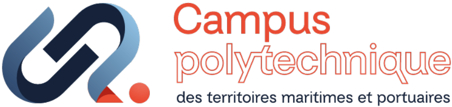
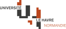
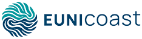

# ECRIN | Talent Finder

## About

**Talent Finder** is a web application that enables discovering and analyzing researcher expertise through their publications and contributions. It facilitates connections between researchers, institutions, and partners by identifying skills and areas of expertise.

## ECRIN

Talent Finder is a sub-project of **ECRIN**, which aims to foster cooperation between researchers from **[Université Le Havre Normandie](https://www.univ-lehavre.fr/)**, the **[Campus Polytechnique des Territoires Maritimes et Portuaires](https://www.cptmp.fr/)**, and the European university alliance **[EUNICoast](https://eunicoast.eu/)**.

### Université Le Havre Normandie

**[Université Le Havre Normandie](https://www.univ-lehavre.fr/)** is a French public higher education and research institution with over 7,000 students from 85 nationalities. It offers 120+ diplomas across Arts, Law, Human Sciences, and Science & Technology, supported by 12 research laboratories and 174 partner institutions worldwide.

**Key figures:**

- 7,000+ students
- 85 nationalities
- 120+ diplomas
- 12 research laboratories
- 174 partner institutions
- 3rd place nationally in ERASMUS rankings

### Campus Polytechnique des Territoires Maritimes et Portuaires

Le **[Campus Polytechnique des Territoires Maritimes et Portuaires](https://www.cptmp.fr/)** is an open-air laboratory unique in Europe. This interdisciplinary consortium unites higher education, research institutions, and economic actors to address major digital, environmental, energy, and social transformations.

**Strategic axes:**

- City of tomorrow
- Maritime and port challenges
- Transitions, risks, and uncertainties

**Operational hubs:**

- Expertise and Qualifications
- Creation and Innovation
- International
- Digital and Technological Platforms
- Sports Academy

**Founding members (12):** CNRS, Communauté urbaine Le Havre Seine Métropole, EMN (École de Management de Normandie), ENSA Normandie, ENSM (École Nationale Supérieure Maritime), ESADHaR, IFEN, INSA Rouen Normandie, Région Normandie, Sciences Po, Synerzip LH, UMEP (Union Maritime et Portuaire du Havre).

### EUNICoast

The European University of Islands, Ports and Coastal Territories, or **[EUNICoast](https://eunicoast.eu/)**, is an alliance of 12 higher education institutions and 88 associated partners across 11 European countries, coordinated by Université Le Havre Normandie.

**Thematic hubs:**

- Local identities and cultures
- Blue economy and sustainable tourism
- Coastal governance
- Biodiversity and environmental health
- Maritime technologies

**Member universities (12):** Université Le Havre Normandie (France), EMUNI University (Slovenia), Burgas Free University (Bulgaria), University of Dubrovnik (Croatia), University of Patras (Greece), University of Sassari (Italy), University of the Azores (Portugal), University of the Balearic Islands (Spain), Stralsund University of Applied Sciences (Germany), Université des Antilles (France), Åland University of Applied Sciences (Finland), West Pomeranian University of Technology (Poland).

## Documentation

- [Contributing Guide](./CONTRIBUTING.md): development workflow and scripts
- [Technical Documentation](./docs/technical-setup.md): installation and configuration
- [Appwrite Setup](./docs/appwrite-setup.md): database configuration
- [Design System](./docs/design-system.md): style guide and components

## License

This project is developed at **[Université Le Havre Normandie](https://www.univ-lehavre.fr/)**.

If you use this software in your research, please cite it using the DOI badge above.

---

  
  &nbsp;&nbsp;&nbsp;&nbsp;
  
  &nbsp;&nbsp;&nbsp;&nbsp;
  

